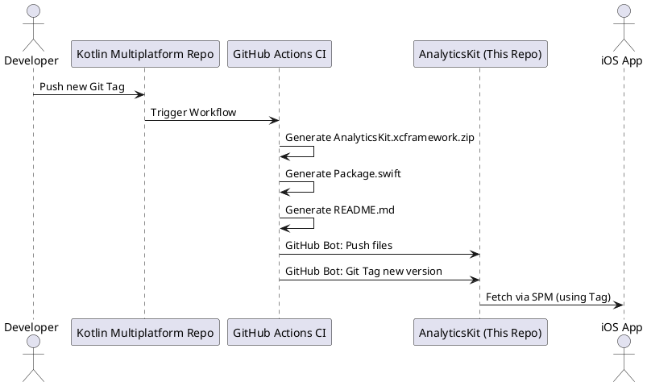

# AnalyticsKit

This repository hosts the Swift Package Manager (SPM) distribution for the `AnalyticsKit` XCFramework, generated from the [Kotlin Multiplatform project](https://github.com/ovicristurean/Native-Android-to-KMP).

## Description

`AnalyticsKit` is a shared module that provides a common interface for analytics tracking across both [Android](https://github.com/ovicristurean/Native-Android-to-KMP) and [iOS](https://github.com/ovicristurean/Native-iOS-to-KMP) platforms. This SPM package facilitates the integration of the iOS framework into Swift-based projects.

### Conceptual Workflow

Automated releases are triggered by new tags in the [source repository](https://github.com/ovicristurean/Native-Android-to-KMP). A GitHub Actions workflow builds the framework, updates the [`Package.swift`](./Package.swift), and generates the [`AnalyticsKit.xcframework.zip`](./AnalyticsKit.xcframework.zip) artifact. Each successful build is automatically tagged in this repository, allowing iOS applications to resolve and fetch specific versions via Swift Package Manager.

